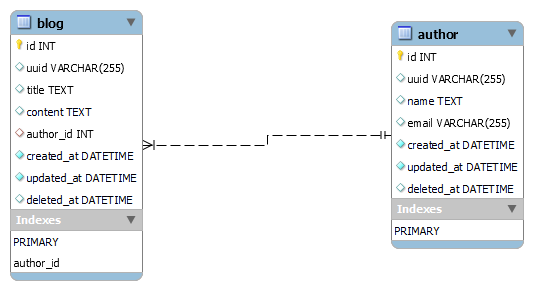

# Project Description: Blogging Platform

## Overview:
The project entails developing the backend infrastructure for a versatile blogging platform. It primarily focuses on providing CRUD (Create, Read, Update, Delete) APIs for effective management of blogs and authors. Each author is capable of creating multiple blogs, but every blog is strictly associated with a single author. The system is designed to grant access to all authors for viewing all blogs, while only the author who created a blog is empowered to update or delete it. 

For secure request authentication to the blog APIs, the header of the API must include the 'author_uuid' parameter.

## Features:
- **CRUD APIs for Blogs and Authors:**
  - Create, list, read, update, and delete functionalities for managing blogs and authors.
- **Authentication Mechanism:**
  - Utilization of 'author_uuid' parameter in the API header for request authentication, ensuring secure interactions with the backend.
- **Access Control:**
  - Restriction of blog update and deletion operations to the author who created the blog, enhancing data integrity and security.
- **Testing and Documentation:**
  - Comprehensive testing of APIs using tools like Postman and thorough documentation to ensure clarity and ease of use for developers.

## Database Architecture


### Description:

This EER diagram illustrates the relational structure of the database, enabling efficient management and querying of author and blog data within the blogging platform.

#### Author Table:
The `author` table represents individuals who contribute content to the blogging platform. It contains attributes such as `id` (Primary Key), `uuid`, `name`, `email`, `created_at`, `updated_at`and `deleted_at`. Each author is uniquely identified by their `id`. We are going to soft delete the author hence we are going to use `deleted_at` for that purpose.

#### Blog Table:
The `blog` table stores the blog posts created by authors. It includes attributes such as `id` (Primary Key), `uuid`, `title`, `content`, `author_id` (Foreign Key), `created_at`, `updated_at`and `deleted_at`. The `author_id` column establishes a one-to-many relationship between the `author` and `blog` tables. This means that each author can write multiple blogs, while each blog is authored by only one author. Again we're going to soft delete the blogs hence `deleted_at` is used for that purpose.

#### Relationship:
The one-to-many relationship between `author` and `blog` is represented by the `author_id` column in the `blog` table. This column references the `id` column in the `author` table, indicating that each blog is associated with exactly one author.

## Project Goals:
- Provide a user-friendly interface for authors to publish and manage their blog posts.
- Foster community engagement through comments and interactions.
- Ensure scalability and robustness to accommodate a growing user base and content repository.
- Implement security measures to protect user data and prevent unauthorized access.

## Technologies Used:
- **Node.js and Express.js:**
  - Node.js as the JavaScript runtime and Express.js as the web application framework for building the backend server.
- **Sequelize.js and MySQL:**
  - Sequelize.js, a promise-based ORM, for seamless interaction with MySQL databases, ensuring efficient data manipulation and management.
- **MySQLWorkbench:**
  - MySQLWorkbench for visual database design, development, and management, enabling easy schema modifications and optimizations.
- **Postman:**
  - Postman for API development, testing, and documentation, facilitating streamlined API interactions and thorough testing.
- **Git and GitHub:**
  - Git for version control, enabling collaborative development and tracking of code changes, and GitHub for hosting the project repository and facilitating collaboration.

## Local Setup:
Using the below mentioned APIs CRUD operations can be performed. However each blog API is restricted to only authorised users. Hence, in order to run any blog related CRUD operation we need to firstly onboard a new author using the Create Author API and then pass the `uuid` of the author in header of the blog API using the key `author_uuid`.

To set up the project locally, follow these steps:

1. Clone the repo using the URL: `www.test.com`.
2. Ensure that Node.js is installed on the machine (`Node version 16 preferred`).
3. Run `npm install` to install the Node modules and dependencies.
4. Ensure that MySQL database is running on the local machine.
5. Create a new file `.env` in the root level of the folder.
6. Input the following content in the `.env` file:

    ```
    PORT = 3000
    DB_HOST = localhost
    DB_USERNAME = root 
    DB_PASSWORD = root
    DB_DATABASE = blogging_platform
    DB_DIALECT = mysql
    ```
7. Create a new database named: `blogging_platform`.
8. Run the following command to start the application: `npm run start`.
9. Use the shared Postman collection to run the APIs (refer the file `Blog.postman_collection.json`).
10. Or just copy the below code and import it in the postman.
```
{
	"info": {
		"_postman_id": "308a39c8-0819-4ab1-9764-da53859e0016",
		"name": "Blogs",
		"schema": "https://schema.getpostman.com/json/collection/v2.0.0/collection.json",
		"_exporter_id": "28296365"
	},
	"item": [
		{
			"name": "Create Author",
			"request": {
				"method": "POST",
				"header": [],
				"body": {
					"mode": "raw",
					"raw": "{\r\n    \"email\":\"iamanauthor@gmail.com\",\r\n    \"name\": \"Author\"\r\n}",
					"options": {
						"raw": {
							"language": "json"
						}
					}
				},
				"url": "http://localhost:3000/author"
			},
			"response": []
		},
		{
			"name": "List Authors",
			"request": {
				"method": "GET",
				"header": [],
				"url": "http://localhost:3000/author"
			},
			"response": []
		},
		{
			"name": "Get Author Details",
			"request": {
				"method": "GET",
				"header": [],
				"url": "http://localhost:3000/author/f81c985d-d0ea-4394-8940-ef8fa40cb375"
			},
			"response": []
		},
		{
			"name": "Update Author",
			"request": {
				"method": "PATCH",
				"header": [],
				"body": {
					"mode": "raw",
					"raw": "{\r\n    \"name\": \"My New Name\",\r\n    \"email\": \"mynewemailaddress@gmail.com\"\r\n}",
					"options": {
						"raw": {
							"language": "json"
						}
					}
				},
				"url": "http://localhost:3000/author/0ea84b1f-b198-4382-b8dd-7d8c68d0c81e"
			},
			"response": []
		},
		{
			"name": "Delete author",
			"request": {
				"method": "DELETE",
				"header": [],
				"url": "http://localhost:3000/author/2a37878c-26ca-4a54-ba95-d87521d53997"
			},
			"response": []
		},
		{
			"name": "Create Blog",
			"request": {
				"method": "POST",
				"header": [
					{
						"key": "author_uuid",
						"value": "f81c985d-d0ea-4394-8940-ef8fa40cb375",
						"type": "text"
					}
				],
				"body": {
					"mode": "raw",
					"raw": "{\r\n    \"title\": \"Travel Together\",\r\n    \"content\": \"Hello everyone, let's travel together and unleash the wilderness together. The world has a lot to offer and we must surely invest our time to travel.\"\r\n}",
					"options": {
						"raw": {
							"language": "json"
						}
					}
				},
				"url": "http://localhost:3000/blog"
			},
			"response": []
		},
		{
			"name": "List Blogs",
			"protocolProfileBehavior": {
				"disableBodyPruning": true
			},
			"request": {
				"method": "GET",
				"header": [
					{
						"key": "author_uuid",
						"value": "f81c985d-d0ea-4394-8940-ef8fa40cb375",
						"type": "text"
					}
				],
				"body": {
					"mode": "formdata",
					"formdata": []
				},
				"url": "http://localhost:3000/blog"
			},
			"response": []
		},
		{
			"name": "Blog Details",
			"request": {
				"method": "GET",
				"header": [],
				"url": "http://localhost:3000/blog/c44e750f-c70b-4ba2-b536-d17bcd857aec"
			},
			"response": []
		},
		{
			"name": "Delete Blog",
			"request": {
				"method": "DELETE",
				"header": [
					{
						"key": "author_uuid",
						"value": "f81c985d-d0ea-4394-8940-ef8fa40cb375",
						"type": "text"
					}
				],
				"url": "http://localhost:3000/blog/d679794c-3337-490e-956b-b40fa5dc6dd3"
			},
			"response": []
		},
		{
			"name": "Update Blog",
			"request": {
				"method": "PATCH",
				"header": [
					{
						"key": "author_uuid",
						"value": "0ea84b1f-b198-4382-b8dd-7d8c68d0c81e",
						"type": "text"
					}
				],
				"body": {
					"mode": "raw",
					"raw": "{\r\n    \"title\": \"Shall I update?\",\r\n    \"content\": \"Do you really think I should update my content? Is improvisation really important?\"\r\n}",
					"options": {
						"raw": {
							"language": "json"
						}
					}
				},
				"url": "http://localhost:3000/blog/c44e750f-c70b-4ba2-b536-d17bcd857aec"
			},
			"response": []
		}
	]
}
```

## Future Enhancements:
- **User Authentication via Login Mechanisms:**
  - Implementation of user authentication mechanisms such as JWT (JSON Web Tokens) or OAuth for enhanced security and personalized user experiences.
- **Engagement Features:**
  - Integration of features like comments, likes, and social sharing to boost user engagement and community interaction.
- **Search and Filtering Functionality:**
  - Addition of search and filtering capabilities to facilitate easy discovery and navigation of blog content.

## Conclusion:
The backend infrastructure of the blogging platform project aims to provide a robust and flexible foundation for managing blogs and authors. By leveraging technologies like Node.js, Express.js, Sequelize.js, and MySQL, along with tools like Postman and GitHub, the project seeks to streamline API development and database management processes. With plans for future enhancements focused on user authentication, engagement features, and performance optimization, the platform aims to deliver an enriching experience for both content creators and consumers.
